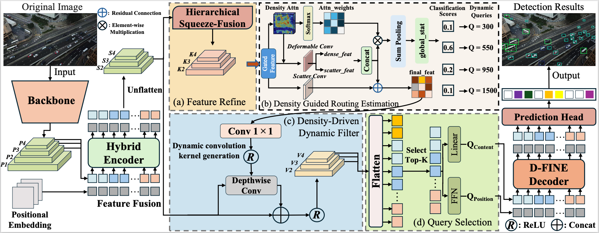
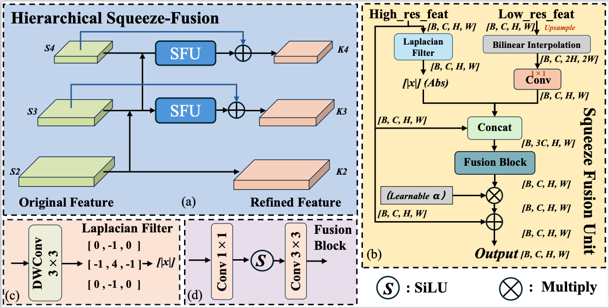

<h2 align="center">
  RDAQ: Real Time DETR meets Refinement-Driven Adaptive Querying for Dense Aerial Imagery
</h2>

<p align="center">
    <a href="./LICENSE">
        
    </a>
    <a href="https://github.com/yourname/RDAQ">
        
    </a>
</p>

<p align="center">
  RDAQ is a real-time DETR-based detector designed for dense small object detection in low-altitude UAV imagery.  
  It extends DEIM/D-FINE by introducing refinement-driven, density-aware adaptive querying.
</p>

---

<p align="center">
  
</p>

---

## 1. Introduction

Low-altitude UAV images typically contain **extremely dense, tiny, and heavily occluded objects**, which makes detection particularly challenging.  
Although DETR-based detectors (RT-DETR, D-FINE, DEIM) have strong global modeling ability, they still rely on a **fixed number of queries**, which leads to:

- **under-detection** in dense scenes  
- **wasted computation** in sparse scenes  
- **unstable convergence**

To address these issues, we propose **RDAQ**, a *Refinement-Driven Adaptive Querying* framework specifically designed for dense aerial imagery.

### 🔑 Core Components

#### ⭐ HSF — Hierarchical Squeeze-Fusion
A top-down refinement module that uses high-level semantics to explicitly activate tiny-object regions in shallow feature maps.

#### ⭐ DGRE — Density Guided Routing Estimat Module
Reformulates counting as a **coarse-grained classification**.  
DGRE predicts density level and dynamically decides the **number of decoder queries** per image.

#### ⭐ DDDF — Density-Driven Dynamic Filter
Generates **sample-specific convolution kernels** based on the global density prior predicted by CCM.

Together, these form:

> **A closed loop of: refinement → density estimation → density-aware dynamic querying**

<p align="center">
  
</p>


---

## 2. Installation

### 2.1 Environment

```bash
conda create -n rdaq python=3.11 -y
conda activate rdaq
pip install -r requirements.txt
````

### 2.2 Requirements

```
faster-coco-eval>=1.6.5
PyYAML
tensorboard
scipy
calflops
thop
transformers
pytorch_wavelets==1.3.0
timm==1.0.7
grad-cam==1.5.4
tidecv
einops
prettytable
pycocotools==2.0.8
```

---

## 3. Dataset Preparation

RDAQ supports the following datasets:

* **DOTA-v1.0**
* **AI-TODv2**

Please structure datasets as:

```text
datasets/
  DOTA-v1.0/
    images/
      train/
      val/
      test/
    annotations/
      instances_train.json
      instances_val.json
      instances_test.json

  AI-TODv2/
    images/
      train/
      val/
      test/
    annotations/
      instances_train.json
      instances_val.json
      instances_test.json
```

Modify dataset configs accordingly (examples in `configs/dataset/`).

---

## 4. Training & Evaluation

### 4.1 Train RDAQ-DFINE-X on DOTA-v1.0

```bash
CUDA_VISIBLE_DEVICES=0,1,2,3 \
torchrun --master_port=7777 --nproc_per_node=4 train.py \
  -c configs/rdaq_dfine/rdaq_dfine_x_dota.yml \
  --use-amp \
  --seed=0
```

### 4.2 Evaluate

```bash
CUDA_VISIBLE_DEVICES=0,1,2,3 \
torchrun --master_port=7777 --nproc_per_node=4 train.py \
  -c configs/rdaq_dfine/rdaq_dfine_x_dota.yml \
  --test-only \
  -r path/to/your_rdaq_model.pth
```

### 4.3 Fine-tuning

```bash
torchrun --nproc_per_node=4 train.py \
  -c configs/rdaq_dfine/rdaq_dfine_x_dota.yml \
  -t path/to/ckpt.pth
```

---

## 5. Ablation

Ablation experiments analyze the contribution of each module:

* ✔ HSF
* ✔ DGRE
* ✔ DDDF

You can toggle them through config:

```yaml
model:
  use_hsf: true
  use_ccm: true
  use_dddf: true
```

---

## 6. Citation

If you use this repository, please cite:

```latex
@misc{rdaq2025,
  title  = {RDAQ: Real Time DETR meets Refinement-Driven Adaptive Querying for Dense Aerial Imagery},
  year   = {2026}
}
```

---

## 7. Acknowledgement

RDAQ is built upon and highly inspired by:

* **DEIM** – [https://github.com/ShihuaHuang95/DEIM](https://github.com/ShihuaHuang95/DEIM)
* **D-FINE** – [https://github.com/Peterande/D-FINE](https://github.com/Peterande/D-FINE)
* **RT-DETR** – [https://github.com/lyuwenyu/RT-DETR](https://github.com/lyuwenyu/RT-DETR)

Thanks to the authors of these excellent open-source works.

```

---

